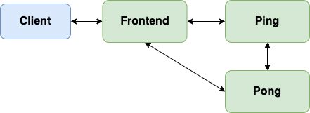

# gRPC echo server

This is a simple ping pong service built using Go and gRPC.

## Proto

- `protoc --go_out=. --go_opt=paths=source_relative --go-grpc_out=. --go-grpc_opt=paths=source_relative ping_pb/ping.proto`
- `protoc --go_out=. --go_opt=paths=source_relative --go-grpc_out=. --go-grpc_opt=paths=source_relative pong_pb/pong.proto`

## Build Images and deploy the application

- `sudo ./scripts/build_images.sh -u xzhu0027 -t latest`
- `kubectl apply -f ping-pong-app.yaml` or `ping-pong-app-istio.yaml`

## Send queries

- `curl http://10.96.88.88:8080/pong-echo?body=hello`
- `./wrk/wrk -d 10s -c 1 -t 1 http://10.96.88.88:8080/ping-echo -s ./envoy/wrk_scripts/echo.lua -L`

## How to build and run wasm filter 

Installation:
- `curl https://sh.rustup.rs -sSf | sh -s -- -y`
- `sudo apt update`
- `sudo apt install -y protobuf-compiler`

Then go the the filter directory

- `./build.sh`
    - This will build the wasm filter and copy it to temp
- `kubectl apply -f echo-server-grpc-istio-full.yaml` 
    - This yaml file is generated by `istioctl kube-inject -f echo-server-grpc-istio.yaml`. It contains the Istio sidecar configuration with a volume that mounts the Wasm Filters into the sidecar container's filesystem.

- `kubectl apply -f <filter>.yaml`
    - Add the wasm filter to echo server. 

Note: 
- You can check the wasm logs use `kubectl logs <echo-server-pod-name> -c istio-proxy  -f`. (Need to use `log.warn!`)
- The filters will be executed in the order in which they are added

## Supported Filters

- ACL
- Admission Control
- Cache
- Compression
- Encryption
- Fault Injection
- Logging
- Metrics
- Mutation
- Rate Limiting